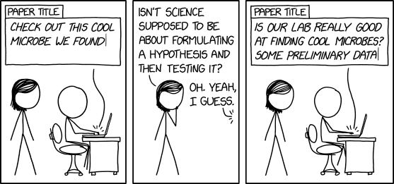

:::: objectives

- Understand author and contributor roles.
- Determine appropriate roles for given contributions.
- Explain common conflicts of interest and how to mitigate them.

::::

::: questions
- What does it mean to author a paper? 
- Are there different roles paper authors take on? 
- Or is the title “author” reserved only for those who put “pen to paper”? 
- Does open science take a different view of authorship? 
:::: 

The idea of authorship and who should be listed as an author has changed over time with the 
open science movement bringing more emphasis to “team science” and a broader definition of 
authorship. 

## Authorship in the Open Science Era

What does it mean to author a paper? Is it just writing, or does it include data curation, software development, and conceptualization? Open science emphasizes transparency and inclusivity, broadening the definition of authorship to include many kinds of contributions.

Oxford Languages defines author as “a writer of a book, article, or report” and while this is 
correct it is also extremely limiting and doesn’t take into account the reality of how research 
outputs are constructed in the 21st century. Today research is done generally in a large team,
and everyone should get credit for the work that they do. This means that authoring a paper can 
include roles that did not exist 50 years ago. A broader definition that takes into account 
current research practices is authorship is the work that goes into writing, editing and 
otherwise preparing a research output for publication including data curation and management, 
developing the methods or software that is used in the research and administrative tasks such 
as supervision, procuring grants or other funding and even conceptualizing the research 
questions. None of these roles are necessarily new, and in fact many publishers have had ways
of capturing this work for many years,  but they have taken on greater importance in the era of 
transparent and inclusive open science. 

### CRediT - Contributor Roles Taxonomy

In 2015, NISO released the “contributors role taxonomy” also known as CRediT as a way to 
standardize and make machine readable the terms being used by publishers when capturing 
authorship roles. These 14 roles are a broad collection of the most common labor that 
contributes to research and research outputs. 

| Role                 | Description |
|----------------------|-------------|
| Conceptualization    | Ideas; formulation or evolution of overarching research goals and aims. |
| Data curation        | Management activities to annotate (produce metadata), scrub data and maintain research data. |
| Formal analysis      | Application of statistical, mathematical, computational techniques. |
| Funding acquisition  | Acquisition of financial support. |
| Investigation        | Conducting a research and investigation process. |
| Methodology          | Development or design of methodology; creation of models. |
| Project administration | Management and coordination responsibility for the research activity planning and execution. |
| Resources            | Provision of study materials, reagents, patients, materials, computing resources. |
| Software             | Programming, software development; designing computer programs. |
| Supervision          | Oversight and leadership responsibility. |
| Validation           | Verification of results. |
| Visualization        | Preparation and presentation of data. |
| Writing – original draft | Preparation, creation of the published work. |
| Writing – review & editing | Critical review, commentary, or revision. |

CRediT is not the only way to define authorship at a role level. Other definitions like the 
[ICMJE's authorship guidelines](https://www.icmje.org/recommendations/browse/roles-and-responsibilities/defining-the-role-of-authors-and-contributors.html), 
define authorship for their journals. Typically a journal’s instructions to authors will cover authorship guidelines. 

::: challenge

## Self-Reflection on Past Roles

Describe the roles you have taken in prior publications. Can you map them to CRediT roles? Were there times you should have received authorship credit but did not? 

:::

::: challenge

## Role Assignment Case Study

Given a fictional research team and their contributions (provided by instructor), assign each team member one or more CRediT roles. Discuss whether they should be listed as authors.

:::

## Conflict of Interest

Conflict of interest (COI) in scholarly communication can be found at many different levels; 
for an author, an editor, or a peer reviewer. This guide will focus on COI and authorship. 
Broadly COI is defined as “any real or perceived influential factor that may influence, bias, 
or affect the motivations of a researcher, thereby affecting their research’s integrity.” 
For authors it can take the shape as an outside relationship (financial or otherwise) with an 
industry sponsor or a close-personal relationship with a peer-reviewer. 

Transparent disclosure is key to maintaining research integrity.

:::: challenge

## COI Quiz

Mark each statement as True (T) or False (F):

1. Financial COIs are the only ones that need to be disclosed.  
2. COIs can exist even if the influence is only perceived, not real.  
3. Authors should disclose close collaborations or personal relationships relevant to their work.  
4. Journals often have different requirements for COI disclosure.  

:::: solution

Answers: F, T, T, T

:::::::
::::::::::::::

::: keypoints
- Authorship in open science includes more than writing; it encompasses many research roles.
- The CRediT taxonomy provides a transparent way to attribute contributions.
- Conflicts of interest can bias research and must be disclosed to maintain trust.
- Open science encourages structured authorship and transparency in conflicts.
:::
